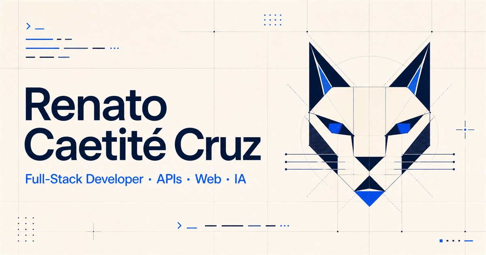

<p align="center">
  
</p>

<h1 align="center">Portfólio · Renato Caetité Cruz</h1>

<p align="center">
  Desenvolvedor Full-Stack com foco em <strong>C# e .NET</strong>, APIs, integrações e produtos que chegam à produção.
</p>

<p align="center">
  <a href="https://renato-caetite-cruz.renatoryuu.chatgpt.site">Ver portfólio</a>
  ·
  <a href="https://www.linkedin.com/in/renatoccz">LinkedIn</a>
  ·
  <a href="https://github.com/renatoryu/flowdesk">FlowDesk</a>
</p>

## Sobre

Este repositório reúne o código do meu portfólio profissional. A proposta foi criar uma experiência autoral — azul, tecnológica e com algumas referências felinas — sem perder clareza para recrutadores e pessoas técnicas.

O conteúdo apresenta minha experiência profissional, formação, principais habilidades e projetos. O foco atual está em C#, .NET, ASP.NET Core, APIs REST, SQL Server e arquitetura de aplicações.

## Projeto em destaque: FlowDesk

<p align="center">
  
</p>

O [FlowDesk](https://github.com/renatoryu/flowdesk) é uma plataforma operacional de Help Desk criada para demonstrar engenharia de produto com .NET de ponta a ponta.

- C# e .NET 10 com ASP.NET Core Web API.
- Arquitetura inspirada em Clean Architecture.
- Entity Framework Core e SQL Server.
- Autenticação JWT com refresh token rotativo e perfis de acesso.
- Front-end em React 19 e TypeScript.
- Docker, Docker Compose e GitHub Actions.
- 244 testes automatizados no backend e cobertura de linhas de 84,18%.
- Aplicação, API e banco publicados em nuvem.

[Abrir demonstração](https://flowdesk-ewe.pages.dev) · [Consultar Swagger](https://flowdesk-api-renato.runasp.net/swagger)

## Tecnologias do portfólio

- React 19 e TypeScript.
- Vinext e Vite.
- CSS responsivo e acessível.
- Open Graph, dados estruturados e otimização para compartilhamento.
- Hospedagem com OpenAI Sites.

## IA como apoio, autoria como direção

A inteligência artificial participou como ferramenta de apoio para explorar alternativas, organizar conteúdo, revisar textos e acelerar iterações. As decisões de posicionamento, identidade, curadoria dos projetos e validação final permaneceram humanas e alinhadas à minha trajetória.

## Executando localmente

```bash
npm install
npm run dev
```

O endereço local será exibido no terminal.

## Verificações

```bash
npm run lint
npm run build
```

---

Projetado e desenvolvido por [Renato Caetité Cruz](https://github.com/renatoryu).
